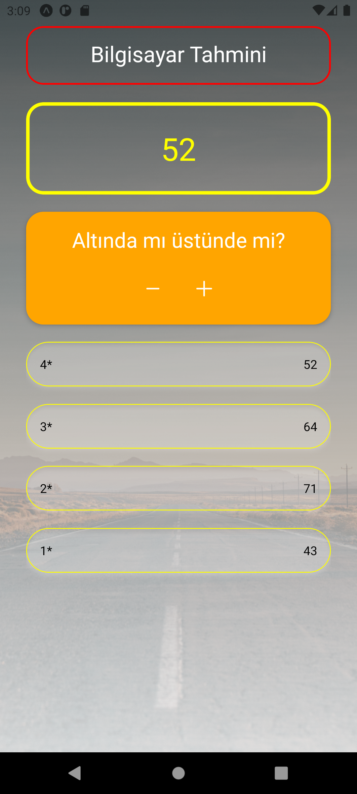

# Number Guessing Game

<div align="center">
  
</div>

## About the Project

This React Native project contains a simple game where the user tries to guess a number. The computer makes random guesses to try and find the number chosen by the user.

## Table of Contents

- [Technologies Used](#technologies-used)
- [Usage](#usage)
- [Project Skeleton](#project-skeleton)
- [Screenshots](#screenshots)

## Technologies Used

- [Expo](https://expo.dev/): Development platform for mobile apps and web.
- [React](https://reactjs.org/): JavaScript library used for building user interfaces.
- [React Native](https://reactnative.dev/): Framework used for building mobile user interfaces.
- [Expo Linear Gradient](https://docs.expo.dev/versions/latest/sdk/linear-gradient/): Expo component used for creating linear gradients.

## Usage

- On the start screen, choose a number between 1 and 99.
- Clear the input with the "Clear" button or confirm the number with the "Confirm" button.
- The computer makes guesses to try and find the chosen number.
- After each guess, use the "Lower" or "Higher" buttons to indicate if the computer's guess is below or above the chosen number.
- The game ends with a screen displaying how many attempts it took the computer to find the chosen number.

## Project Skeleton

```
Number Guessing Game (folder)
│
├── assets
│     └── [images]
├── components
│     ├── ComputerGuess.jsx 
│     ├── ComputerNumber.jsx 
│     ├── CustomButton.jsx       
│     └── Title.jsx 
├── screens
│     ├── GameOverScreen.jsx 
│     ├── GameScreen.jsx      
│     └── GameStartScreen.jsx 
├── .gitignore
├── App.js
├── app.json
├── babel.config.js
├── package-lock.json
├── package.json
└── README.md
```

## Screenshots

<div align="center">
  
  
  
</div>